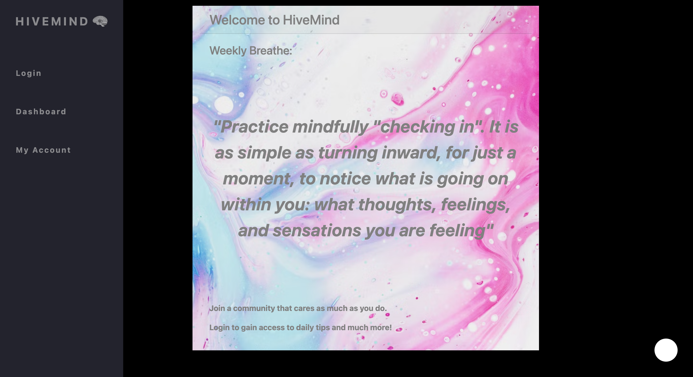
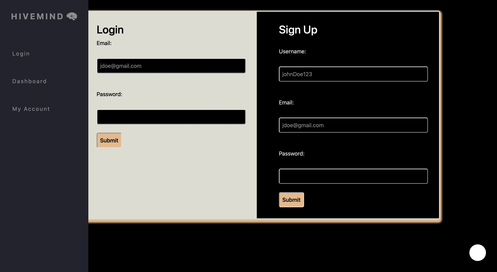
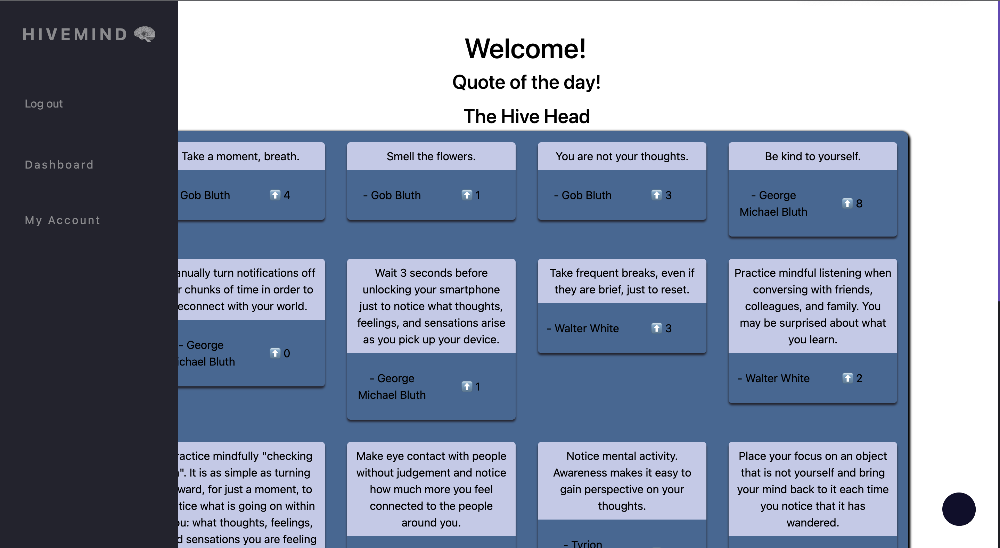
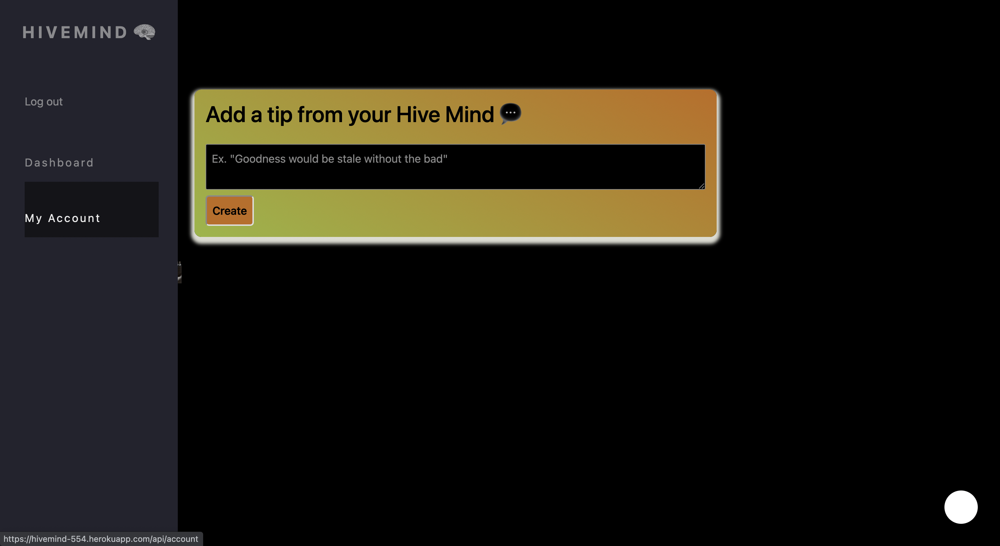

# Hive Mind - A Mental Health Community Support Application

A mental health community application to connect mental health advocates in a place where they can share tips and get daily inspiration to remain mindful of their own mental health.

## Description

HiveMind offers access to a digital community of mental health advocates where they can share tips with each other, upvote the most useful, and get daily inspiration to remain mindful in their own lives.

## Table of Contents

- [Installation](#installation)
- [Usage](#usage)
- [License](#license)
- [Contribute](#contribute)
- [Questions](#questions)

## Installation

Clone this repository, install Node and then run install to install all dependencies.

`npm install`

Run.

`npm start`

Seed the database

`node seeds/index.js`

## Usage

Begin by running with `npm start`

[`Heroku Deployed Application`](https://hivemind-554.herokuapp.com/)

## License

This project is under the MIT license.

## Contribute

Contributors can clone the repository and reach out through the contacts provided in the Questions section.

## Questions

For any questions about this project, please contact any of the team members at:

Email: kenneth.maclean84@gmail.com

Github: https://github.com/DoshPocket

Email: ramankangz@outlook.com

Github: https://github.com/ramriddlez

Email: bdejene19@gmail.com

Github: https://github.com/bdejene19

Email: navraj777@hotmail.com

Github: https://github.com/gammahazard

